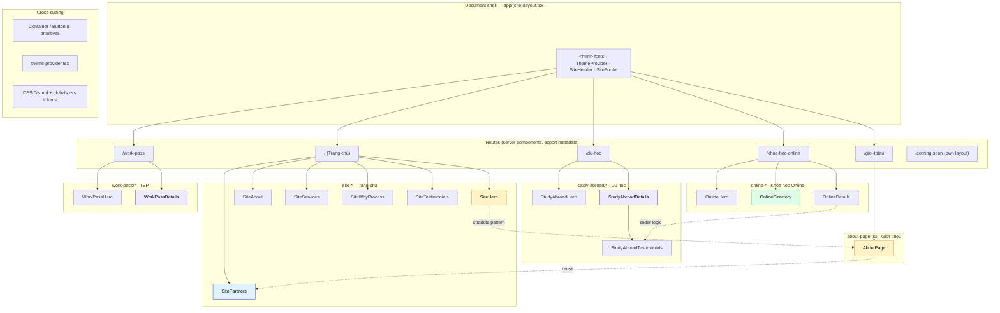

# KVC Global — Architecture

> Generated from the GitNexus knowledge graph + filesystem audit.
> Stack: **Next.js 16** (App Router) · **React 19** · **TypeScript 5** · **Tailwind CSS v4** · **framer-motion v12**.

KVC Global is a Vietnamese-language marketing site for an education / migration consultancy. It presents four service offerings — Du học Singapore, Khóa học Online, Training Employment Pass (TEP), and a company introduction — each as a static page composed from reusable section components. There is **no backend, no API, and no database**: content is hard-coded as typed constants inside the components, and the only client state is UI (mobile menu, tabs, sliders, theme).

---

## Overview

```
src/
├── app/
│   ├── (site)/                 ← public site route group
│   │   ├── layout.tsx         ← <html>/<body>, fonts, ThemeProvider, header, footer
│   │   ├── page.tsx           ← Trang chủ (landing)
│   │   ├── du-hoc/            ← Du học Singapore
│   │   ├── khoa-hoc-online/   ← Khóa học Online
│   │   ├── work-pass/         ← Training Employment Pass
│   │   └── gioi-thieu/        ← Giới thiệu
│   ├── coming-soon/           ← standalone pre-launch page (own layout)
│   ├── globals.css            ← Tailwind v4 @theme brand tokens + base
│   └── favicon.ico
├── components/
│   ├── site-*                 ← Trang chủ (landing) sections
│   ├── study-abroad/*         ← Du học sections
│   ├── online-*               ← Khóa học Online sections
│   ├── work-pass/*            ← TEP sections
│   ├── about-page.tsx         ← Giới thiệu (single-file page)
│   ├── site-header*.tsx       ← header shell + logo + nav + actions + mobile
│   ├── site-footer.tsx
│   ├── site-partners.tsx      ← shared partner marquee
│   ├── theme-provider.tsx     ← next-themes-style light/dark provider
│   └── ui/                    ← Container, Button primitives
└── lib/
    └── utils.ts               ← cn() (clsx + tailwind-merge)
```

### Key properties
- **Route group `(site)`** wraps the five public pages and shares one `layout.tsx` that owns the document shell (`<html lang="vi">`, four Google fonts, `ThemeProvider`, `SiteHeader`, `SiteFooter`, `<main>`).
- **`coming-soon/`** has its own `layout.tsx` and renders outside the `(site)` group — no header/footer.
- **Each page is a server component** that exports `metadata` (title/description/OG/Twitter cards using `/images/thumb-sharing.png`) and returns a fragment of section components. Pages themselves are thin; all markup lives in `components/`.
- **Sections are client components** (`"use client"`) when they need state or framer-motion; pure-presentational sections stay server components. A single page mixes both freely — Next.js App Router handles the boundary.

---

## Functional Areas (Clusters)

GitNexus indexed one high-cohesion cluster (**Components**, 44 symbols, 84% cohesion). The filesystem reveals four logical subsystems plus three cross-cutting layers:

### 1. Trang chủ (Landing) — `components/site-*`
Composed by `app/(site)/page.tsx`:
- `site-hero.tsx` — hero with floating stats card that **straddles the hero/next-section boundary** (`absolute bottom-0 translate-y-1/2`).
- `site-partners.tsx` — marquee of partner logos (`--animate-marquee`), **shared** with the About page.
- `site-about.tsx`, `site-services.tsx`, `site-why-process.tsx`, `site-testimonials.tsx`, `site-stat-bar.tsx`.

### 2. Du học Singapore — `components/study-abroad/*`
`app/(site)/du-hoc/page.tsx` → `StudyAbroadHero` + `StudyAbroadDetails`. `study-abroad-details.tsx` is the composition root that renders the inner sections: `intro`, `majors`, `why`, `prospects`, `requirements`, `services`, `support`, `faqs`, `testimonials`.

### 3. Khóa học Online — `components/online-*`
`app/(site)/khoa-hoc-online/page.tsx` → `OnlineHero` + `OnlineDirectory` + `OnlineDetails`. `online-directory.tsx` is the most logic-rich component (see *Key Execution Flow* below); `online-details.tsx` owns the testimonials slider.

### 4. Training Employment Pass — `components/work-pass/*`
`app/(site)/work-pass/page.tsx` → `WorkPassHero` + `WorkPassDetails`. Mirrors the study-abroad structure: `details` composes `services`, `target`, `process`, `requirements`, `fees`, `faqs`, `review`.

### 5. Giới thiệu — `components/about-page.tsx`
`app/(site)/gioi-thieu/page.tsx` → `AboutPage`. A single large client component (motion + straddle-stats pattern reused from `site-hero`).

### Cross-cutting: Header / Footer / Theme / UI
- `site-header.tsx` → re-exports `SiteHeaderShell`. The shell renders an **absolutely-positioned** `header` (`absolute top-0 z-50`, height `h-15 md:h-24`) so every hero section must add top padding (`pt-28 sm:pt-32 md:pt-36`) to clear it. Mobile menu state lives in the shell.
- `theme-provider.tsx` — a hand-rolled `next-themes` substitute. Injects a FOUC-prevention IIFE via `useServerInsertedHTML`, manages `light|dark|system` with `localStorage` persistence + cross-tab `storage` sync + `prefers-color-scheme` media listener. `dark` variant defined in `globals.css` as `@custom-variant dark (&:is(.dark *))`.
- `ui/container.tsx` — `Container` primitive: `mx-auto w-full max-w-7xl px-5 sm:px-6 md:px-8 lg:px-10 xl:max-w-[1440px] 2xl:max-w-[1600px]`. The single source of truth for page gutters and max-width.
- `ui/button.tsx` — shadcn-style CVA button.

### Cross-cutting: Design tokens — `app/globals.css`
Tailwind v4 `@theme` block defines the brand palette (`brand-blue`, `brand-blue-mid`, `brand-gold`, `brand-gold-light`, `brand-dark`, `brand-light`), font families (Montserrat headings, Be Vietnam Pro body), `--radius-brand`, and the marquee keyframe. `:root` and `.dark` define the semantic surface tokens (`--background`, `--foreground`, `--primary`, etc.) consumed via the `@theme inline` indirection. Color application rules live in `DESIGN.md`.

---

## Key Execution Flow

GitNexus indexed one intra-community process; the filesystem shows it is the most interesting client-side flow in the app:

### `OnlineDirectory → ExtractLevel` (3 steps, `components/online-directory.tsx`)

```
1. OnlineDirectory           (root component — tabbed program catalog)
2. hasLevelPrograms(programs) (decides which layout to render)
3. extractLevel(title)       (regex: /^(Level\s+\d+)/i → "Level N" prefix)
```

`OnlineDirectory` holds `activeId` (the selected program category) in `useState`. On each render it calls two pure helpers:

- `hasLevelPrograms(active.programs)` — true if any program title starts with "Level N".
- `isSingleProgram(active.programs)` — true if the category has ≤1 program.

These select one of **three layout components** (a discriminated render branch):

| Condition | Layout | Visual |
|-----------|--------|--------|
| has Level programs | `TimelineLayout` | vertical center-rail timeline, alternating left/right cards, animated rail draw + staggered blur-in items |
| single program | `ImageTextLayout` | image-left / text-right card |
| otherwise | `CardGridLayout` | responsive 1/2/3-column grid |

`extractLevel` is called per-card inside `TimelineLayout` to split the title into a "Level N" badge and the remainder, and is also what `hasLevelPrograms` keys off — so the same regex drives both the layout choice and the card's internal badge. This is the only indexed flow but the same *category→layout* discrimination pattern recurs in `OnlineDetails` and `StudyAbroadDetails`.

### Other notable runtime flows (not yet indexed)
- **Testimonials slider** (`online-details.tsx`, `study-abroad-testimonials.tsx`, `site-testimonials.tsx`) — horizontal `scrollBy`/`scrollTo` snap container with arrow buttons + dot indicators. `online-details` measures `cardsPerView` at runtime (`ResizeObserver`-style listener) and derives `pageCount = TESTIMONIALS.length - cardsPerView + 1` so dots map to scroll pages, while arrows scroll by exactly one card width.
- **Theme init** (`theme-provider.tsx`) — SSR-injected IIFE sets `.light`/`.dark` on `<html>` before hydration; React effect reconciles with `localStorage`/media query afterwards.
- **Header mobile menu** (`site-header-shell.tsx`) — `open` state in the shell, toggled by `SiteHeaderMobileToggle`, rendered by `SiteHeaderMobileMenu`.

---

## Architecture Diagram



Solid arrows = direct composition (page renders section). Dashed = pattern reuse: `AboutPage` reuses `SitePartners`; the straddle-stats pattern originates in `SiteHero` and is mirrored in `AboutPage`; the testimonials slider logic in `OnlineDetails` mirrors `StudyAbroadTestimonials`.

---

## Conventions

- **Page = thin server component, sections = components.** Never inline section markup in a route file.
- **One `Container` per section.** Sections are full-bleed `<section>` wrappers that own their background + vertical padding; `Container` inside them handles centering + gutters. Do not add `mx-auto`/`max-w-*`/`px-*` to sections directly.
- **Absolute header ⇒ padded heroes.** Because `SiteHeader` is `absolute top-0 z-50`, every hero adds `pt-28 sm:pt-32 md:pt-36` (or equivalent) so content clears the `h-15 md:h-24` bar.
- **Color tokens, not raw hex.** Use `bg-brand-blue-mid`, `text-brand-gold`, `text-brand-gold-light`, etc. from `@theme`. Mixed scheme (per `DESIGN.md`): button/card backgrounds → `brand-blue-mid`; text → `brand-blue` / `brand-gold`; icon color → `#F8BC62` (`brand-gold-light`); icon container bg → `brand-blue-mid` / `secondary`.
- **Motion via framer-motion variants.** Define `fadeUp`/`stagger`/`staggerFast` variants and apply with `whileInView` + `viewport={{ once: true, margin: "-80px" }}`. When mixing framer-motion transforms with Tailwind `translate-*` positioning (e.g. the straddle `translate-y-1/2`), split a **static outer wrapper** (owns positioning) from an **inner `motion.div`** (owns the entrance animation) — framer-motion's inline `transform` otherwise overrides Tailwind.

## Indexed stats

- Files: 67 · Symbols: 209 · Relationships: 372 · Processes: 1 · Clusters: 1 (Components, 84% cohesion).
- The index is **2 commits behind HEAD**. Run `npx gitnexus analyze` to refresh before relying on `impact`/`context` for symbols touched in recent work (`about-page`, `online-*`, `online-details` slider).
